# Year Dots - Your Year in 365 Dots

<p align="center">
  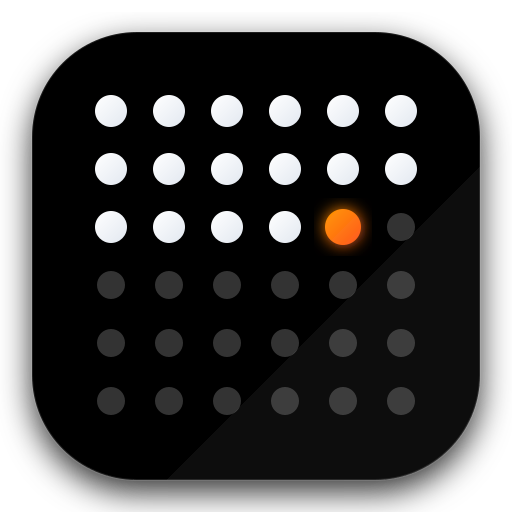
</p>

<p align="center">
  <strong>A minimalist Android wallpaper that visualizes your year's progress, one day at a time</strong>
</p>

<p align="center">
  
  
  
  
  
</p>

---

## About Yeardots

**Yeardots** is a minimalist **life calendar** and **productivity wallpaper** for Android that visualizes your year as a 365-dot grid. It transforms your home screen into a daily reminder of time's passage (Memento Mori), helping you beat procrastination and live more intentionally.

> *"We have two lives, and the second begins when we realize we only have one."* — Confucius

Designed for fans of **Stoicism**, **digital minimalism**, and quantifiable self-improvement, Yeardots offers a quiet, offline, and battery-friendly way to stay visualized on your long-term goals. Every midnight, one more dot fills in—nudging you to make today count.

---

## Features

### Core Functionality
- **365-Dot Calendar Grid** - Visual representation of the entire year
- **Material 3 Premium UI** - Beautiful, fluid interface with glassmorphism effects and spring-physics animations
- **Automatic Daily Updates** - Wallpaper refreshes at midnight using WorkManager
- **Fully Customizable Colors** - Choose colors for past, present, future, and background with smooth cross-fade transitions
- **Animated Controls** - Utilize premium `SegmentedButton` controls to elegantly select shapes and sizes
- **Four Dot Shapes** - Circle, Rounded Square, Square, and Pill
- **Four Size Options** - Tiny, Small, Medium, and Large dot densities
- **Pro Grid Editor** - Fully responsive 8-handle layout editor to perfectly align dots around your lock screen clock, featuring fluid spring-animated layout shifts
- **OEM Clock Presets** - Built-in lock screen clock guides (Small, Medium, Large, XL) for precise visual placement
- **Live Preview** - See changes in real-time before applying

### Privacy & Performance
- **100% Offline** - No internet permission, no tracking, zero ads
- **Battery Efficient** - Optimized background tasks with minimal battery impact
- **AMOLED-Friendly** - Dark backgrounds conserve battery on modern displays
- **No Data Collection** - Your privacy is guaranteed

---

## Screenshots(OLD VERSION)

<p align="center">
  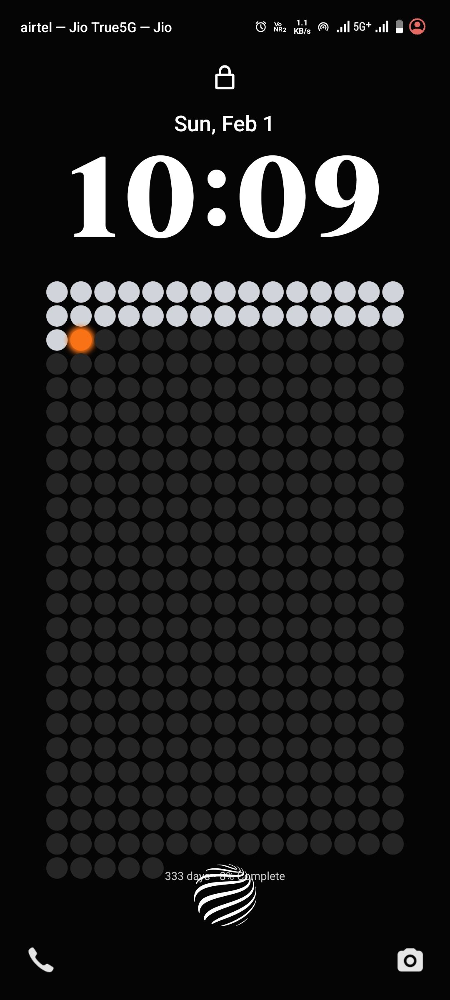
  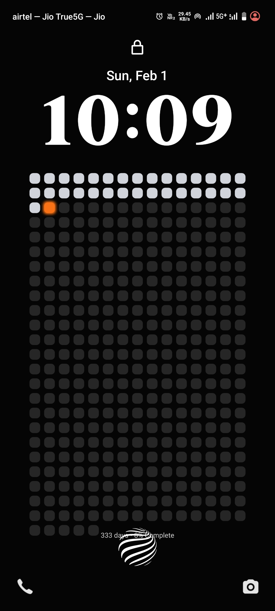
  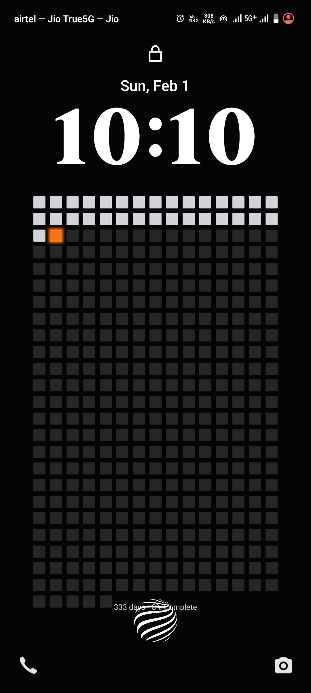
  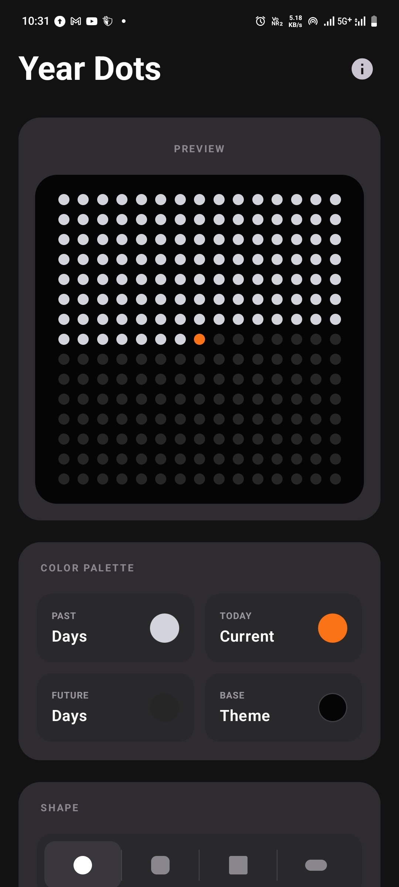
  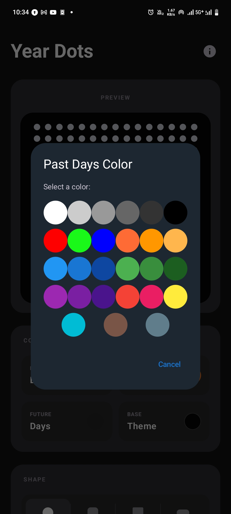
  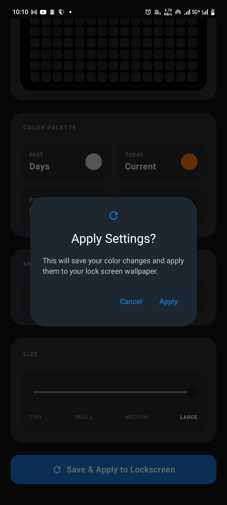
  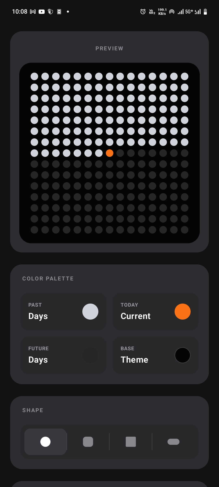
  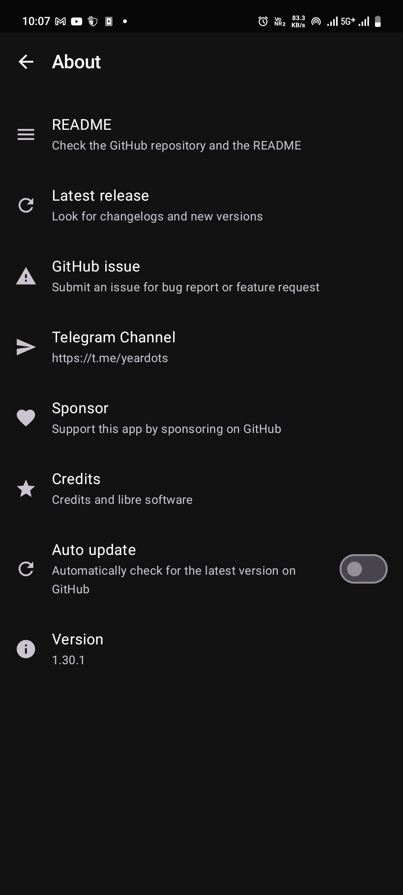
  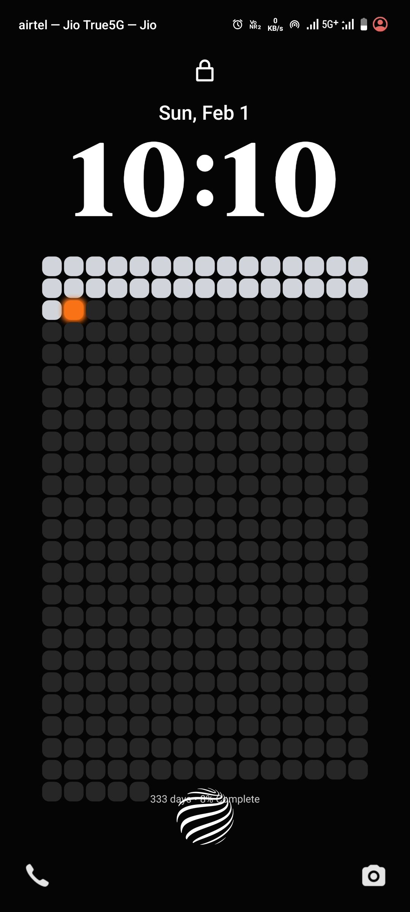
</p>

---

## Installation

### Option 1: Download APK (Recommended)
1. Go to [Releases](https://github.com/ikrishanaa/Yeardots/releases)
2. Download the latest `YearDots-v*.apk`
3. Install on your Android device (you may need to enable "Install from Unknown Sources")

### Option 2: F-Droid (Coming Soon)
Year Dots will be available on F-Droid repository soon. See our [Publishing Guide](PUBLISHING.md) for details on F-Droid submission.

### Option 3: Build from Source
```bash
git clone https://github.com/ikrishanaa/Yeardots.git
cd year-dots
./gradlew assembleDebug

```

---

## Quick Start

1. **Install the app** using one of the methods above
2. **Open Year Dots** and configure your preferred colors
3. **Tap "Set Wallpaper"** to apply
4. That's it! Your wallpaper will auto-update daily at midnight

### Customization Options
- **Colors**: Customize past days, today, future days, and background
- **Shapes**: Choose from Dot, Rounded, Square, or Pill
- **Size**: Select Tiny, Small, Medium, or Large density
- **Preview**: See all changes in real-time before applying

---

## Technical Stack

| Component | Technology |
|-----------|-----------|
| **Language** | Kotlin |
| **UI Framework** | Jetpack Compose (Material 3) |
| **Background Tasks** | WorkManager |
| **Data Persistence** | DataStore (Preferences) |
| **Graphics Engine** | Android Canvas API |
| **Architecture** | MVVM-inspired, Repository pattern |

### Key Dependencies
- `androidx.work:work-runtime-ktx` - Daily wallpaper updates
- `androidx.datastore:datastore-preferences` - Settings storage
- `androidx.compose.material3:material3` - Modern UI components

---

## Project Structure

```
app/
├── core/
│   └── WallpaperGenerator.kt      # Canvas rendering logic
├── data/
│   └── SettingsRepository.kt      # DataStore wrapper
├── worker/
│   └── WallpaperWorker.kt         # Background update worker
├── util/
│   └── WorkScheduler.kt           # Task scheduling
├── receiver/
│   └── BootReceiver.kt            # Reschedule after reboot
├── ui/
│   ├── components/                # Reusable Compose components
│   └── theme/                     # Material 3 theme
└── MainActivity.kt                # Main UI and ViewModel logic
```

---

## How It Works

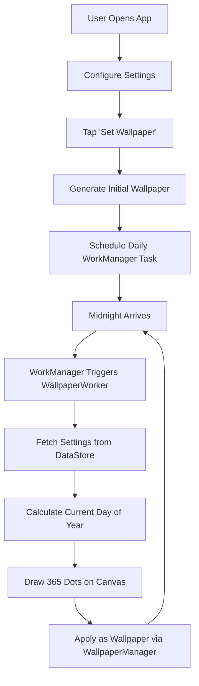

### Wallpaper Generation Algorithm
1. Calculate current day of year (1-365/366)
2. Create bitmap sized to screen dimensions
3. Calculate responsive grid geometry based on custom user bounds and aspect ratio
4. For each of the 365/366 positions:
   - Determine color (past/today/future)
   - Apply selected shape (circle, rounded, square, pill)
   - Scale according to dynamic cell size and dot density
5. Apply subtle glow effect for visual depth
6. Set as system wallpaper

---

## Contributing

Contributions are welcome! Please read [CONTRIBUTING.md](CONTRIBUTING.md) for details on:
- Reporting bugs
- Suggesting features
- Submitting pull requests
- Code style guidelines

---

## Found a Bug?

Please check [existing issues](https://github.com/ikrishanaa/Yeardots/issues) first. If your bug hasn't been reported:
1. Open a [new issue](https://github.com/ikrishanaa/Yeardots/issues/new/choose)
2. Use the bug report template
3. Include your Android version and device model
4. Attach screenshots if possible

---


## License

This project is licensed under the **MIT License** - see the [LICENSE](LICENSE) file for details.

**TL;DR:** You can freely use, modify, and distribute this code. Attribution appreciated but not required.

---

## Acknowledgments

**Inspiration:**
- [4,000 Weeks: Time Management for Mortals](https://www.oliverburkeman.com/books) by Oliver Burkeman
- Memento mori tradition
- Life calendar visualizations ([WeeklyDots](https://play.google.com/store/apps/details?id=com.weeklydots), [One Dot](https://play.google.com/store/apps/details?id=com.onedot.lifetracker))
- [Wait But Why's Life Calendar](https://waitbutwhy.com/2014/05/life-weeks.html)

**Special Thanks:**
- The Jetpack Compose community
- F-Droid for championing open-source Android apps
- Everyone who values intentional living

---

## Author

**Krishana**  
*Year Dots v1.0 - January 2026*

- Report bugs: [GitHub Issues](https://github.com/ikrishanaa/Yeardots/issues)
- Suggest features: [Feature Requests](https://github.com/ikrishanaa/Yeardots/issues/new/choose)
- Email: krishanaindia773@gmail.com
- Telegram: [t.me/yeardots](https://t.me/yeardots)

---

## Stats

<p align="center">
  
  
  
</p>

---

<p align="center">
  <sub>Made with care and awareness</sub>
</p>

<p align="center">
  <i>"The trouble is, you think you have time." - Buddha</i>
</p>
